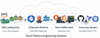

<h1 align="center">Hi, I'm Odainkey</h1>

  

Cloud Solutions Architect | DevOps & Platform Engineer

I design and build **secure, scalable cloud platforms** using AWS, Terraform, Kubernetes, and GitOps.

My work focuses on **platform engineering**, enabling development teams to provision infrastructure safely through automation while maintaining strong governance, security, and operational visibility.

Background:

• 16+ years in Petroleum Geoscience and subsurface data analysis  
• 6+ years designing cloud-native platforms and DevOps automation  
• Experience building AWS landing zones, Kubernetes platforms, and enterprise DevSecOps pipelines

---

# Core Expertise

• AWS Cloud Architecture  
• Platform Engineering  
• Infrastructure as Code (Terraform)  
• Kubernetes (Amazon EKS)  
• GitOps (ArgoCD)  
• CI/CD Automation (GitHub Actions)  
• Cloud Security & Governance  
• Observability (Prometheus, Grafana)  
• Enterprise Networking (Transit Gateway, multi-VPC architecture)

---

# Featured Platform Projects

## AWS Enterprise Multi-Account Landing Zone

Enterprise AWS landing zone built with Terraform providing a secure cloud foundation for organizations.

Key capabilities:

• Automated AWS Organizations and OU structure  
• Account Vending Machine for developer self-service  
• IAM Identity Center RBAC automation  
• Service Control Policies (SCP) governance guardrails  
• Centralized security and audit accounts  
• Immutable log archive with organization-wide CloudTrail  
• Shared networking architecture  
• GitHub Actions CI pipeline for automated platform deployment

This platform enables **secure self-service AWS account provisioning while maintaining centralized governance.**

Repository  
https://github.com/dainmusty/enterprise-aws-multi-account-landing-zone

---

## Kubernetes Platform on AWS (EKS)

Production-ready Kubernetes platform designed for scalable microservice deployments.

Platform capabilities:

• Amazon EKS cluster architecture  
• ArgoCD GitOps App-of-Apps deployment model  
• AWS ALB Ingress Controller for traffic routing  
• Persistent storage using EBS CSI driver  
• Infrastructure provisioning with Terraform

This platform enables **GitOps-based application delivery and automated Kubernetes platform management.**

Repository  
https://github.com/dainmusty/terraform-aws-eks-platform

---

## Kubernetes Observability Platform

Production-style monitoring stack built using Prometheus and Grafana.

Capabilities include:

• Kubernetes cluster monitoring  
• ArgoCD controller metrics  
• MongoDB performance monitoring  
• Custom Grafana dashboards  
• Prometheus alerting with Alertmanager

This platform provides **full operational visibility into infrastructure and workloads.**

Repository  
https://github.com/dainmusty/prometheus-grafana-observability-stack

---

## DevSecOps CI/CD Platform

Enterprise DevSecOps pipeline built with GitHub Actions.

Capabilities include:

• Terraform infrastructure provisioning  
• Kubernetes deployment automation  
• Security scanning with Trivy  
• OWASP dependency vulnerability scanning  
• Code quality analysis using SonarCloud

The pipeline automates **secure infrastructure deployment and GitOps-based application delivery.**

Repository  
https://github.com/dainmusty/devsecops-github-actions-pipeline

---

## Advanced AWS Networking Architecture

Designed enterprise networking patterns using:

• AWS Transit Gateway  
• Multi-VPC architecture  
• Shared services VPC  
• Route53 Resolver endpoints  
• VPC endpoints for private service access

This architecture enables **secure connectivity across multiple AWS accounts and environments.**

---

## Stock Analysis & Data Engineering Project

A data-driven application designed to analyze financial market trends.

Features include:

• automated data ingestion pipelines  
• financial data analysis workflows  
• visualization and reporting

---

# Platform Engineering Focus

My work typically focuses on solving three key platform engineering challenges.

### Secure Cloud Foundations

Designing AWS landing zones and governance models that allow organizations to adopt cloud safely.

### Developer Self-Service Infrastructure

Building platforms that allow engineers to provision infrastructure automatically while enforcing security guardrails.

### Observability and Reliability

Implementing monitoring, alerting, and automation that ensure infrastructure and applications remain reliable and scalable.

---
# Technologies
### Cloud
AWS

### Infrastructure as Code
Terraform

### Containers
Docker  
Kubernetes  
Amazon EKS

### GitOps
ArgoCD

### Monitoring
Prometheus  
Grafana

### CI/CD
GitHub Actions
Jenkins
---

# Connect With Me
LinkedIn  
https://linkedin.com/in/odainkey-mustapha
---

If you're interested in **cloud platform engineering, DevOps, or AWS architecture**, feel free to connect.
